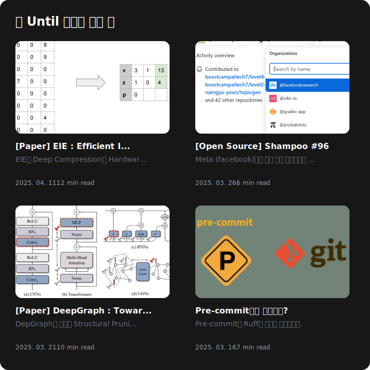

# Until Blog GitHub README 위젯

[](https://until.blog/@octoping)

Until 블로그의 최신 글을 GitHub 프로필에 표시할 수 있는 동적 SVG 위젯입니다.

Until 블로그의 최신 글 4개를 자동으로 보여줍니다.

## 사용법

GitHub 프로필 저장소에 다음 워크플로우 파일을 추가하세요:
`.github/workflows/blog-widget.yml`

```yaml
name: Update Until Blog Widget
on:
  # 매일 자정에 실행
  schedule: [{cron: "0 0 * * *"}]
  # 수동 실행 가능
  workflow_dispatch:
  # 선택적: 저장소 푸시 시 실행
  push: {branches: ["master", "main"]}

jobs:
  blog-widget:
    runs-on: ubuntu-latest
    permissions:
      contents: write
    steps:
      - uses: actions/checkout@v3

      - uses: octoping/until-github-readme@v1
        with:
          username: <USERNAME>>  # Until 블로그 사용자명
          # 선택적 설정:
          # max_posts: 4  # 표시할 최대 포스트 수
          # title: "📝 Until 블로그 최신 글"  # 위젯 제목
          # theme: "dark"  # 테마 (dark/light)
          # filename: "blog-widget.svg"  # 출력 파일명

      - name: Commit changes
        run: |
          git config --local user.email "github-actions[bot]@users.noreply.github.com"
          git config --local user.name "github-actions[bot]"
          git add blog-widget.svg
          git commit -m "Update blog widget" || echo "No changes to commit"
          git push
```

GitHub 프로필 저장소 `README.md`에 다음 내용을 추가하세요:
```
<div align="left">
  
</div>

```

## 개발 환경 설정

### 필수 요구사항

- Node.js 20.x 이상
- AWS 계정 (배포 시 필요)
- Serverless Framework CLI

### 설치

```bash
# 저장소 클론
git clone https://github.com/your-username/until-github-readme.git
cd until-github-readme

# 의존성 설치
npm install
```

### 로컬 개발

```bash
# 로컬 서버 실행
npm run dev

# TypeScript 빌드
npm run build
```

### 배포

```bash
# 개발 환경 배포
npm run deploy

# 프로덕션 환경 배포
npm run deploy:prod
```

## 기여하기

프로젝트 기여는 언제나 환영합니다! 다음과 같은 방법으로 참여하실 수 있습니다:

1. 이슈 등록
2. Pull Request 제출
3. 코드 리뷰 참여
