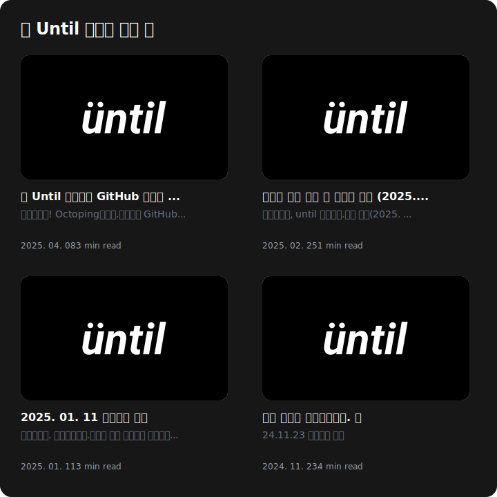

# Until Blog GitHub README 위젯


<div align="left">
  
</div>

Until 블로그의 최신 글을 GitHub 프로필에 표시할 수 있는 동적 SVG 위젯입니다.

Until 블로그의 최신 글 4개를 자동으로 보여줍니다.

## 사용법

GitHub 프로필 저장소에 다음 워크플로우 파일을 추가하세요:
[blog-widget.yml](https://github.com/untilled/until-github-readme/tree/main/.github/workflows/blog-widget.yml)

(예를 들어, 사용자 이름이 `untilled`인 경우 경로는 `untilled/untilled/.github/workflows/blog-widget.yml`입니다.)

GitHub 프로필 저장소 `README.md`에 다음 내용을 추가하세요:
```markdown
<div align="left">
  
</div>
```

## 개발 환경 설정

### 필수 요구사항

- Node.js 20.x 이상
- AWS 계정 (배포 시 필요)
- Serverless Framework CLI

### 설치

```bash
# 저장소 클론
git clone https://github.com/your-username/until-github-readme.git
cd until-github-readme

# 의존성 설치
npm install
```

### 로컬 개발

```bash
# 로컬 서버 실행
npm run dev

# TypeScript 빌드
npm run build
```

### 배포

```bash
# 개발 환경 배포
npm run deploy

# 프로덕션 환경 배포
npm run deploy:prod
```

## 기여하기

프로젝트 기여는 언제나 환영합니다! 다음과 같은 방법으로 참여하실 수 있습니다:

1. 이슈 등록
2. Pull Request 제출
3. 코드 리뷰 참여
